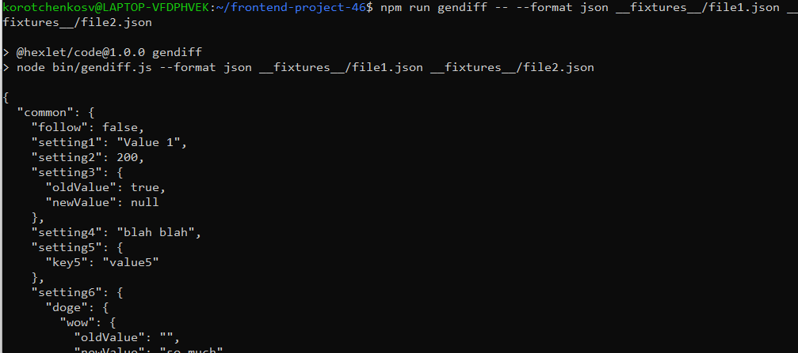
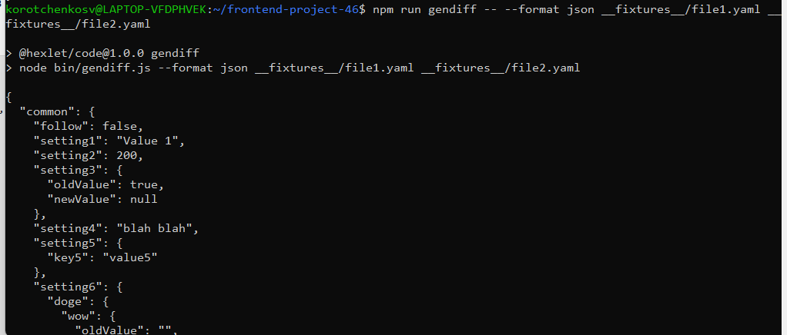
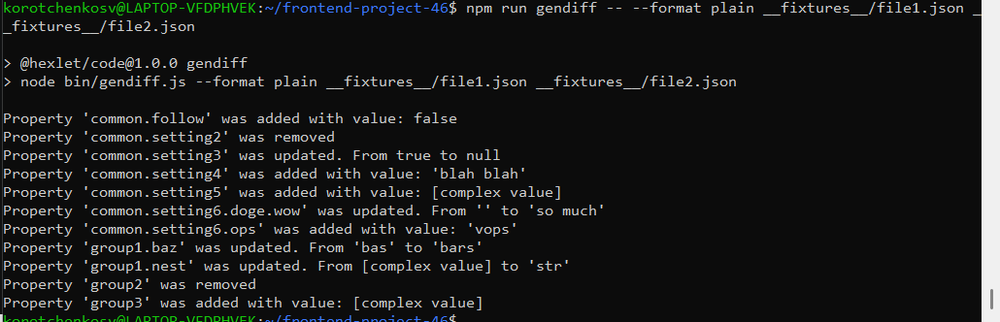

### Hexlet tests and linter status:
[](https://github.com/KorotchenkoSV/frontend-project-46/actions)
[](https://sonarcloud.io/summary/new_code?id=KorotchenkoSV_frontend-project-46)
[](https://sonarcloud.io/summary/new_code?id=KorotchenkoSV_frontend-project-46)

# gendiff

Утилита для сравнения конфигурационных файлов.

## Пример работы

**Сравнение JSON-файлов/YAML-файлов:**
```bash

npm run gendiff [options] <filepath1> <filepath2>

Доступные варианты:
-f, --format [type] - укажите формат вывода (по умолчанию stylish)
-h, --help - отображение справочной информации
```
###Демонстрация интерфейса




